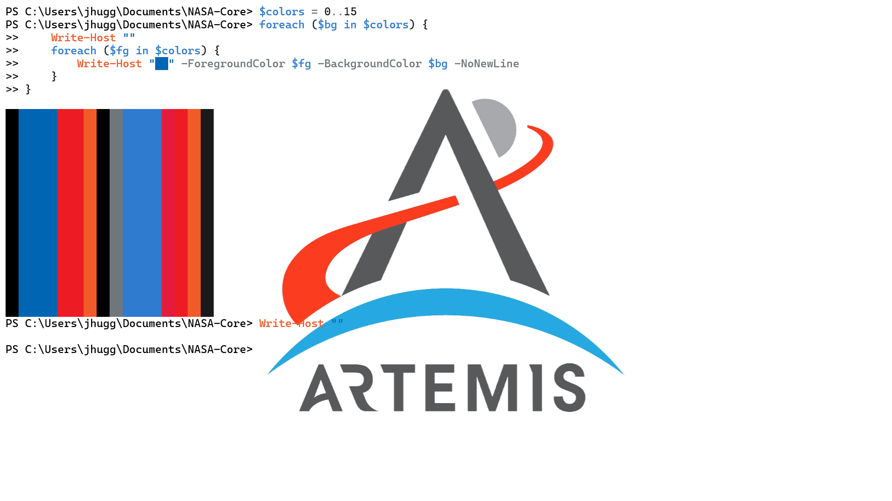

<p align="center">
    
    <h2 align="center">NASA-Core Theme</h2>
</p>

<h3 align="center">Inspired by the Artemis II lunar flyby album</h3>

<p algin="center"> Not affiliated with the project, just a geek who likes space</p>

## Theme variants

Palettes are organized by appearance:

| Variant | Folder | Description |
|---------|--------|-------------|
| **Dark** | [`dark/`](./dark/) | Original Artemis USWDS palette — dark backgrounds, light text |
| **Light** | [`light/`](./light/) | Light palette — white backgrounds, black text, same accent colors |

Each folder contains matching files for Windows Terminal, VS Code/Cursor, Vim, and PtPython.

## Usage

### Windows Terminal

**Dark**

1. Open `settings.json` from Windows Terminal
2. In the `schemes` section, paste the contents of `dark/artemis-uswds-dark.scheme.json`
3. In the `themes` section, paste the contents of `dark/artemis-uswds-dark.theme.json`
4. Set `colorScheme` and `theme` to **Artemis USWDS Dark**

**Light**

1. Paste `light/artemis-uswds-light.scheme.json` into `schemes`
2. Paste `light/artemis-uswds-light.theme.json` into `themes`
3. Set `colorScheme` and `theme` to **Artemis USWDS Light**

Example profile configuration:

```json
{
    "profiles": {
        "defaults": {
            "colorScheme": "Artemis USWDS Dark"
        }
    },
    "theme": "Artemis USWDS Dark"
}
```

### VS Code / Cursor

The VS Code extension lives in `nasa-core-artemis/` and ships both **nasa-core-artemis-dark** and **nasa-core-artemis-light**.

#### Install from source (recommended)

1. Install [Node.js](https://nodejs.org/) if you do not already have it.
2. Install the VS Code extension packaging tool:

    ```powershell
    npm install -g @vscode/vsce
    ```

3. Package the extension from the repo root:

    ```powershell
    cd nasa-core-artemis
    vsce package
    ```

4. Install the generated `.vsix` file:
   - **VS Code / Cursor:** open the Extensions view, open the `...` menu, choose **Install from VSIX...**, and select `nasa-core-artemis-0.0.1.vsix`
   - **CLI:** `code --install-extension .\nasa-core-artemis-0.0.1.vsix`

5. Reload the editor if prompted.

#### Try without packaging (development)

1. Open the `nasa-core-artemis` folder in VS Code or Cursor.
2. Press `F5` to launch an **Extension Development Host** window.
3. In the new window, open the color theme picker and select **nasa-core-artemis-dark** or **nasa-core-artemis-light**.

#### Apply the theme

1. Open the Command Palette (`Ctrl+Shift+P` on Windows/Linux, `Cmd+Shift+P` on macOS).
2. Run **Preferences: Color Theme** (or press `Ctrl+K`, then `Ctrl+T`).
3. Select **nasa-core-artemis-dark** or **nasa-core-artemis-light**.

#### Theme files

| File | Description |
|------|-------------|
| `nasa-core-artemis/themes/nasa-core-artemis-dark-color-theme.json` | Full dark extension theme |
| `nasa-core-artemis/themes/nasa-core-artemis-light-color-theme.json` | Full light extension theme |
| `dark/artemis-uswds-dark-vscode.json` | Minimal dark reference theme |
| `dark/artemis-uswds-dark-vscode.jsonc` | Full dark UI theme with workbench customizations |
| `light/artemis-uswds-light-vscode.json` | Minimal light reference theme |
| `light/artemis-uswds-light-vscode.jsonc` | Full light UI theme with workbench customizations |

### Vim

**Dark**

**Windows**
1. Copy `dark/artemis_uswds_dark.vim` into `~\vimfiles\colors\`
2. Add `colorscheme artemis_uswds_dark` to your vim configuration (e.g. `~\_vimrc`)

**Linux**
1. Copy `dark/artemis_uswds_dark.vim` into `~/.vim/colors/`
2. Add `colorscheme artemis_uswds_dark` to `~/.vimrc`

**Light**

**Windows**
1. Copy `light/artemis_uswds_light.vim` into `~\vimfiles\colors\`
2. Add `colorscheme artemis_uswds_light` to your vim configuration

**Linux**
1. Copy `light/artemis_uswds_light.vim` into `~/.vim/colors/`
2. Add `colorscheme artemis_uswds_light` to `~/.vimrc`

### PtPython

**Note**: As of IPython version 9.7.0, you cannot integrate custom color palettes. However, PtPython allows this in the integrated iPython functionality (i.e. `ptipython`).

**Dark**

1. Copy `dark/ptpython-config-dark.py` to `$PTPYTHON_CONFIG_HOME`
2. Point ptpython at the config (e.g. `ptpython --config-file $env:PTPYTHON_CONFIG_HOME/ptpython-config-dark.py`)

**Light**

1. Copy `light/ptpython-config-light.py` to `$PTPYTHON_CONFIG_HOME`
2. Point ptpython at the config (e.g. `ptpython --config-file $env:PTPYTHON_CONFIG_HOME/ptpython-config-light.py`)

## Gallery
### Dark Mode

**Windows Terminal**


**Vim**


**PtPython**


### Light Mode 
**Windows Terminal**

