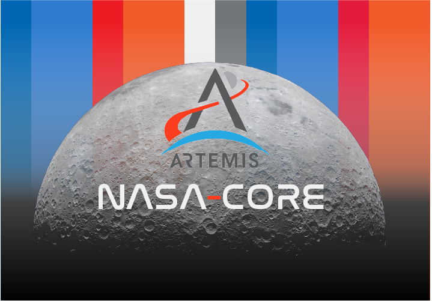
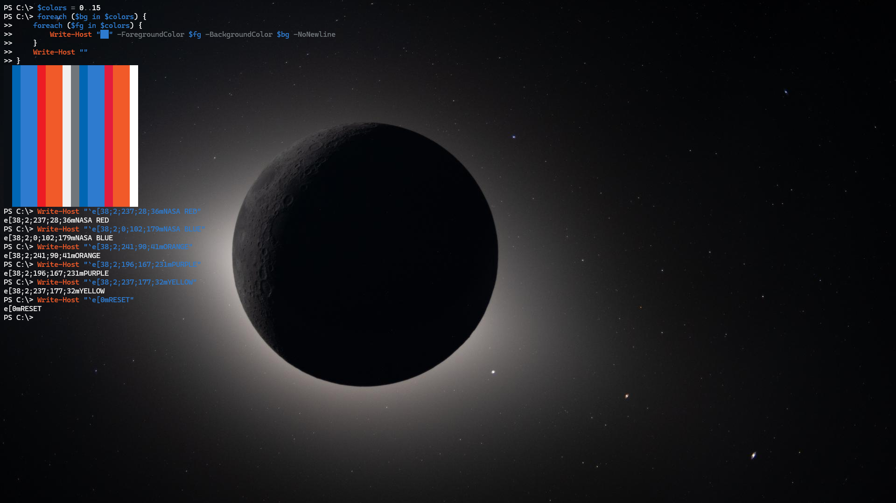
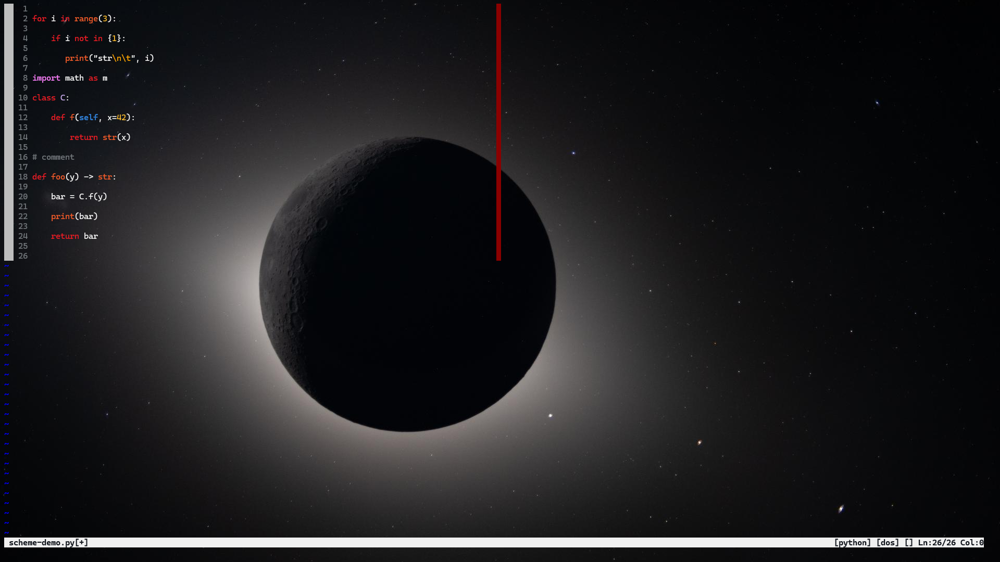
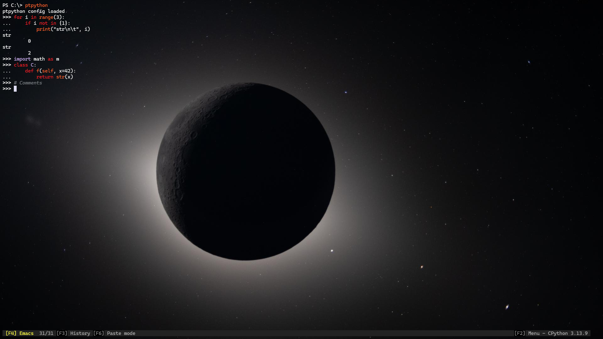

<p align="center">
    
    <h2 align="center">NASA-Core Theme</h2>
</p>

<h3 align="center">Inspired by the Artemis II lunar flyby album</h3>

<p algin="center"> Not affiliated with the project, just a geek who likes space</p>

## Usage

### Windows Terminal
1. Open `settings.json` from Windows Terminal
2. In the `schemes` section of the file, paste the contents of the `artemis-uswds.scheme.json` file
3. Navigate to the `themes` section and paste the contents of the corresponding theme file (e.g. `artemis-uswds.theme.json`).
4. Update `colorScheme` within the `profiles` section to include your chosen scheme:

    ```json
    {
        "profiles": {
            "defaults": {
                "colorScheme": "Artemis USWDS"
            }
        }
    }
    ```

5. Update `theme` to use your chosen theme:

    ```json
    {
        "theme": "Artemis USWDS"
    }
    ```

### Vim
**Windows**
1.  Copy the `artemis_uswds.vim` file into the `~\vimfiles\colors\` directory
2.  Paste `colorscheme artemis_uswds` into your vim configuration file, (i.e. `~\_vimrc`)

**Linux**
1. Copy the `artemis_uswds.vim` file into the `~/.vim/colors/`
2. Paste `colorscheme artemis_uswds` into your vim configuration file `~/.vimrc` 

### PtPython
**Note**: As IPython version 9.7.0, you cannot integrate custom color palettes. However, PtPython allows
this in the integrated iPython functionality (i.e. `ptipython`)

1. Copy the `config.py` file into the location of `$PTPYTHON_CONFIG_HOME`
2. specify the configuration file location to ptpython (e.g. `ptpython --config-file $env:PYTHON_CONFIG_HOME/config.py`

## Gallery

**Windows Terminal**



**Vim**



**PtPython**



